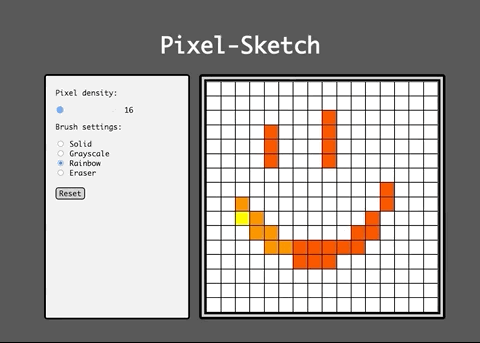

# Pixel-Sketch

Simple Web Etch-a-Sketch clone!

## Usage
Clone the repo and open `index.html` in a Browser (tested on Chrome, Firefox and Safari).

## Controls
### Pixel Density
Use the Pixel density slider to change the canvas pixel density. Default is a 16x16 pixel canvas.
**Note:** Changing the pixel density will also reset the canvas.

### Brush Settings
- **Solid**: Draws a solid black colored pixel.
- **Grayscale**: Draws a light gray colored pixel that becomes darker as you draw over it.
- **Rainbow**: Draws a rainbow colored pixel. The pixel cycles through the colors of the rainbow as you draw over it.
- **Eraser**: Erase any color applied by the other settings.

### Reset
Reset the canvas.
**Warning**: Your artwork will not be saved!
